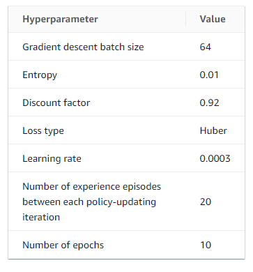
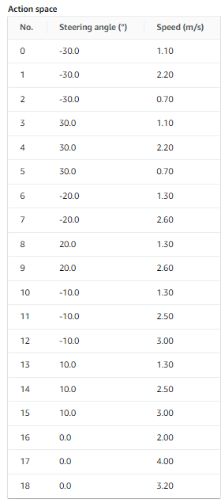

# Detalhes do modelo usado
**Nome do modelo: acoesdiscreto-v2**

## Configuração de hiperparâmetros



- Única alteração feita foi no fator de desconto, o qual mudei de 0.99 para 0.92, visando dar menos peso às recompensas futuras em comparação com as recompensas imediatas.

## Espaço de ações do modelo

- Uma das principais características do modelo que apresento é o espaço de ação dele, que ao invés de ser contínuo, com infinitas ações disponíveis para o modelo, selecionei um espaço discreto e definido de ações, sendo essas representadas abaixo:
 

## Função de recompensa

- Tendo em vista que o objetivo é completar a pista no menor tempo possível e saindo da pista a menor quantidade possível de vezes, utilizei dois parâmetros principais para recompensar o modelo: Sua proximidade ao centro da pista e sua velocidade. 
- **Proximidade ao centro:** dei recompensas maiores quando o modelo se encontra muito próximo do centro, mas ainda deixei uma margem de distância que ele poderia estar e ainda receberia uma boa recompensa, visto que nem sempre o melhor é se manter ao centro, como em curvas que ele pode querer se afastar um pouco.
- **Velocidade:** a ideia é que o modelo escolha sempre as ações de maior velocidade e que ainda o mantenham dentro da pista, por isso, recompensei-o sempre que estiver com a velocidade acima de 1 m/s.

```py
def reward_function(params):
    
    track_width = params['track_width']
    distance_from_center = params['distance_from_center']
    speed = params['speed']
    
    marker_1 = 0.1 * track_width
    marker_2 = 0.25 * track_width
    marker_3 = 0.5 * track_width
    
    
    if distance_from_center <= marker_1:
        reward = 1.5
    elif distance_from_center <= marker_2:
        reward = 0.9
    elif distance_from_center <= marker_3:
        reward = 0.2
    else:
        reward = 1e-3
        
    if speed < 1:
        reward = reward + 0.5
    else:
        reward = reward + 1.0
    
    return float(reward)
```