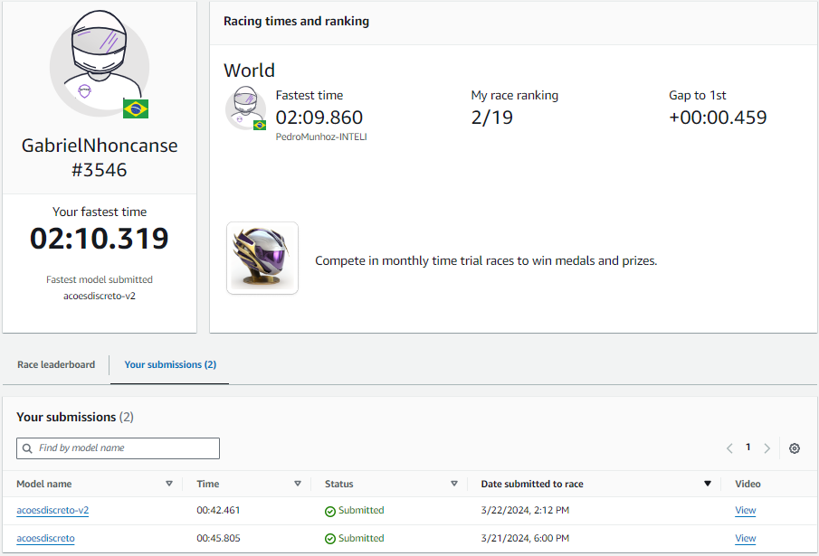
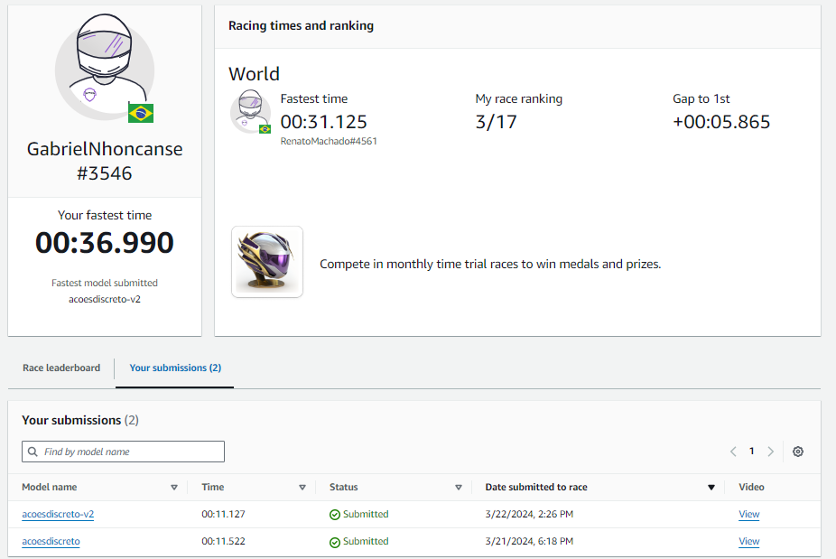

# Resultados obtidos

- OBS: Vale ressaltar que a colocação no momento da correção pode não ser a mesma da apresentada nas imagens, uma vez que, após o print ter sido tirado, outros participantes podem ter submetidos seus modelos e obtidos tempos melhores que o meu modelo.
- Mais informações sobre o modelo na pasta "**Modelo**"

## Resultados obtidos na Pista 1

Link pista 1: https://us-east-1.console.aws.amazon.com/deepracer/home#raceToken/ApZEB9jSQAGHw52N8o5oYQ

### Informações gerais

- Foram feitos dois testes, sendo o modelo "acoesdiscreto-v2" o modelo final.
- Foi conquistado a 2º colocação na pista.

## Resultados obtidos na Pista 2

Link pista 2: https://us-east-1.console.aws.amazon.com/deepracer/home#raceToken/l9O6vdL9SHiLnkG_RLQ8CA

### Informações gerais

- Foram feitos dois testes, sendo o modelo "acoesdiscreto-v2" o modelo final.
- Foi conquistado a 3º colocação na pista.